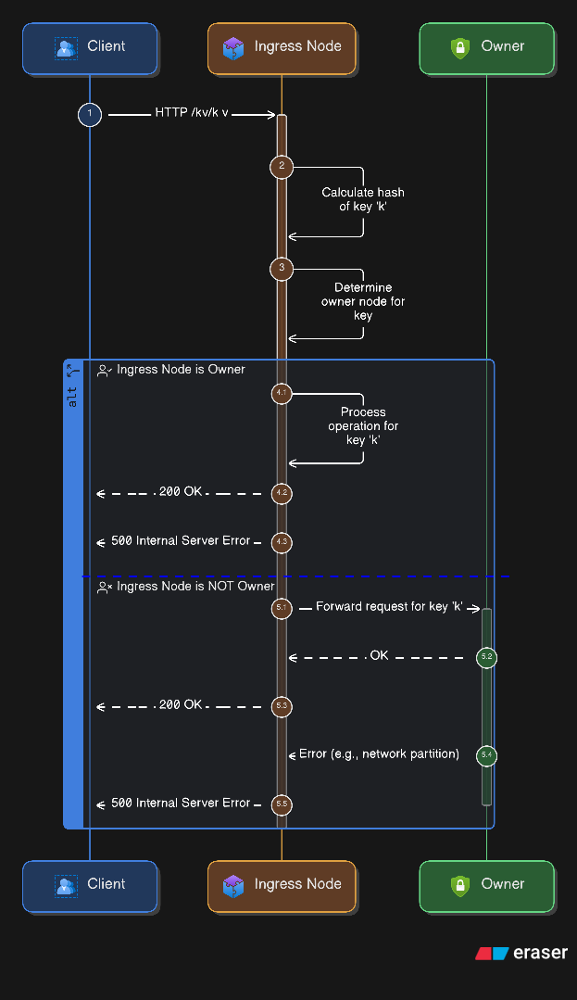

# ZephyrCache — a self-healing distributed cache

## Started
- Docker Compose to run a local cluster
- Core KV store
- HTTP API and basic metrics
- etcd-backed membership via leases (ephemeral keys, watch-based join/leave)
- Cluster routing via consistent hash ring and request forwarding
- Gossip-based membership and failure detection (skeleton not working yet defaulting to etcd)
- Prometheus metrics, Grafana dashboards

## Quick start
```bash
# Run with default configuration (1 cache node, 1 etcd node, default docker network)
docker-compose -f deploy/docker-compose.yml up -d

# Test the cluster
curl localhost:8080/healthz
curl -X PUT localhost:8080/kv/foo -d 'bar'
curl localhost:8080/kv/foo

# Scale to more nodes
docker-compose -f deploy/docker-compose.yml up -d --scale node=10
```


## Viewing logs
```bash
# View logs from all nodes in real-time
docker-compose -f deploy/docker-compose.yml logs -f node

# View logs from all services (etcd + nodes)
docker-compose -f deploy/docker-compose.yml logs -f

# View logs from a specific container
docker logs -f deploy-node-1

# View last 100 lines
docker-compose -f deploy/docker-compose.yml logs --tail 100 node
```

## Stopping the cluster
```bash
# Stop all containers
docker-compose -f deploy/docker-compose.yml down
```

## etcd Lease Sequence

```markdown
Notes:
- Attach all ephemeral membership/heartbeat keys to the same lease (e.g., leaseID 0x1234).
- KeepAlive is a long-lived gRPC stream; send pings around TTL/3 to maintain headroom.
- On lease expiry or revoke, etcd deletes all keys bound to that lease and emits watch events.
- Peers watch the prefix (/zephyrcache/members/) to detect joins/leaves promptly.
```

## Consistent Hash Ring


```markdown
Notes:
- t1..t4 are token positions on the ring (0..2^m-1).
- hash(k) = point p on the ring.
- Owner(k) = first node clockwise from p.

Example:
  hash("user:42") = position between t2 and t3 → Owner = N3.
```

## Request Forwarding


## Not Started
- Replication factor (N), quorum reads/writes (tunable consistency)
- Rebalancing hooks for node joins/leaves
- Anti-entropy sync (Merkle trees)
- Chaos testing, improved dashboards, and alerts
- Phi accrual failure detector
- Hinted handoff, read-repair, anti-entropy (Merkle)
